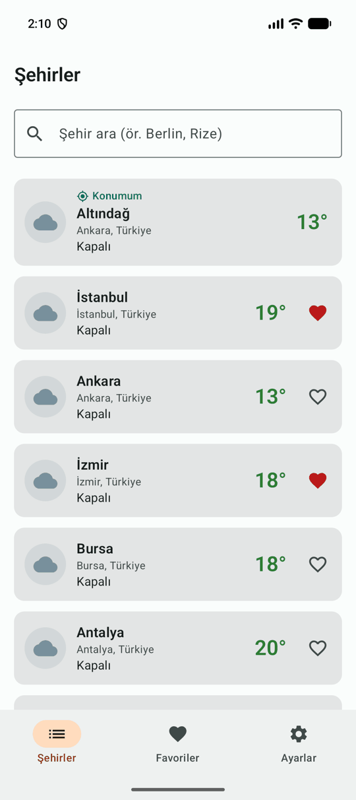
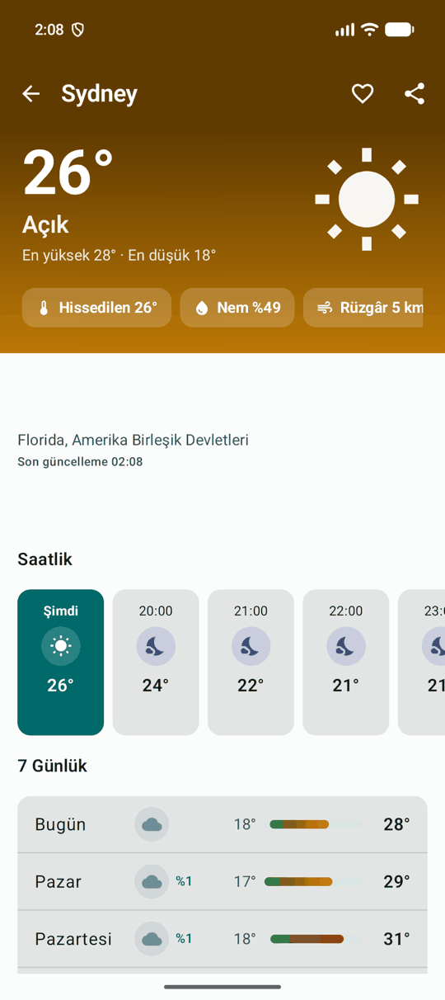
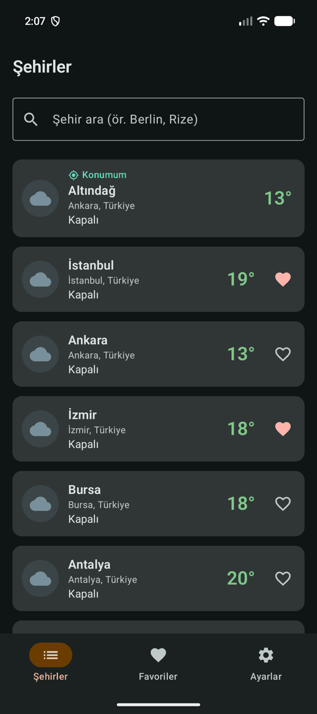
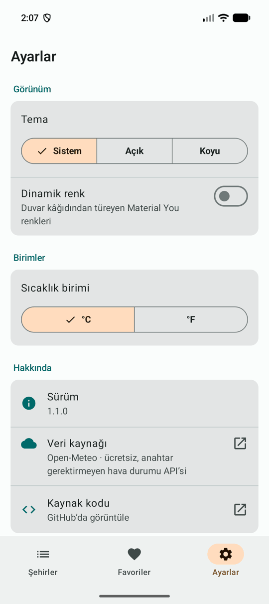
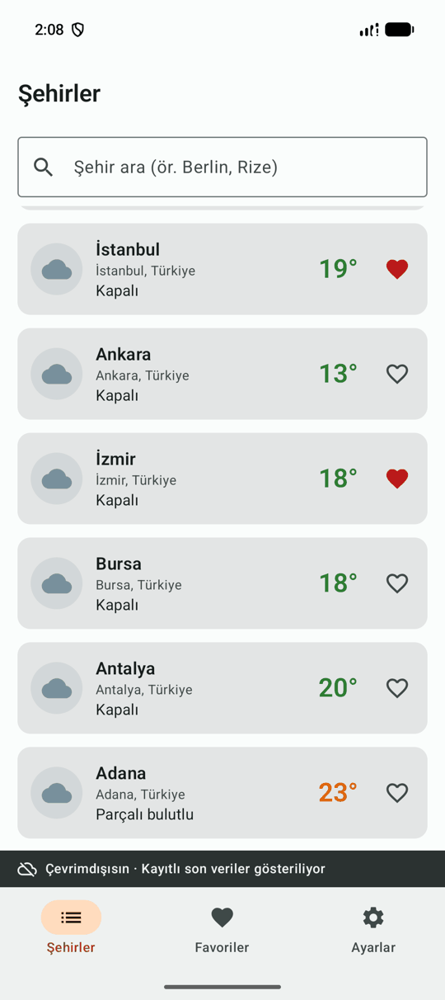
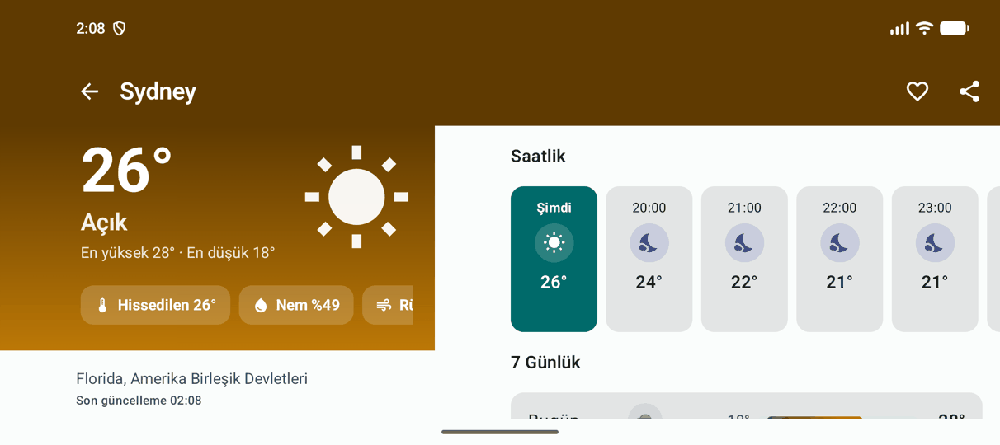

# Hava — Hava Durumu Keşif Uygulaması

[](https://github.com/htenlik/weather-app/actions/workflows/pull-request.yml)

KAMP+ Bilişim Kampı "Keşif Uygulaması" hava durumu projesi. Şehirlerin anlık havasını listeler, seçilen şehrin
saatlik ve 7 günlük tahminini gösterir, favori şehirleri cihazda saklar; yükleniyor / veri / boş / hata
durumlarının tamamını ele alır. **1.1.0** sürümü kamp referans çözümünün (1.0.0) üstüne konum, ayarlar,
çevrimdışı mod, İngilizce ve yeni bir görsel dil ekler.

**Teknoloji:** Kotlin · Jetpack Compose (Material 3) · Clean Architecture · Coroutines & StateFlow · Hilt ·
Retrofit + OkHttp · Room · DataStore · Navigation Compose

## Ekranlar

| Şehirler | Tahmin | Koyu tema | Ayarlar |
|---|---|---|---|
|  |  |  |  |

| Çevrimdışı | Yatay / tablet |
|---|---|
|  |  |

## 1.1.0'da neler var?

- **Konumum kartı** — cihaz konumundaki hava, listenin başında. İzin akışının her hali ele alınır: ilk istek,
  "bir daha sorma" (uygulama ayarlarına kısayol), konum servisleri kapalı (konum ayarlarına kısayol), hata ve tekrar
  deneme. Konum, Play Services'e bağımlı olmadan `LocationManager` ile alınır; yer adı `Geocoder`'dan gelir.
- **Ayarlar** — tema (sistem / açık / koyu), Material You dinamik renk, °C / °F, hakkında. Tercihler DataStore'da;
  açılışta okunana kadar splash ekranı kalır, tema yanıp sönmez. Birim değişince liste, favoriler, detay ve
  paylaşım metni anında güncellenir.
- **Çevrimdışı mod** — bağlantı yokken son alınan yanıtlar HTTP önbelleğinden sunulur, alt çubuğun üstünde
  "Çevrimdışısın" şeridi belirir, her ekranda "Son güncelleme HH:mm" bilgisi vardır. Bağlantı geri gelince hata
  ekranındaki veriler kendiliğinden yenilenir.
- **Görsel yenileme** — koşula göre renklenen vektör ikonlar (gece için ay), gradient detay başlığı,
  "Şimdi" vurgulu saatlik kartlar, haftalık aralığa göre ölçeklenen günlük sıcaklık çubukları, soğuk→sıcak
  renklenen sıcaklıklar, tamamlanmış Material 3 renk rolleri, animasyonlu durum ve liste geçişleri.
- **Geniş ekran ve erişilebilirlik** — tablette / yatayda iki sütunlu listeler ve iki bölmeli detay; ekran
  okuyucu için tek parça okunan kartlar, başlık işaretleri, kendini duyuran çevrimdışı şeridi; büyük yazı
  tipinde kırpılmayan metinler.
- **İngilizce** — tüm metinler `values-en` altında; gün adları, yüzde ve hız yazımı cihaz dilini izler.

Tam liste: [CHANGELOG.md](CHANGELOG.md)

## API — Open-Meteo (API key gerekmez)

| Amaç | Çağrı |
|---|---|
| Anlık hava (çoklu şehir tek istekte) | `https://api.open-meteo.com/v1/forecast?latitude=41.01,39.92&longitude=28.98,32.85&current=temperature_2m,weather_code&timezone=auto` → JSON **dizi** |
| Tahmin (tek şehir) | `.../v1/forecast?latitude=..&longitude=..&current=..&hourly=temperature_2m,weather_code,precipitation_probability&daily=weather_code,temperature_2m_max,temperature_2m_min&forecast_days=7&timezone=auto` → JSON **nesne** |
| Şehir arama | `https://geocoding-api.open-meteo.com/v1/search?name=Ankara&count=20&language=tr` → sonuç yoksa `results` alanı hiç gelmez (= Boş durum) |

- `weather_code` WMO standardındadır (0 açık, 61 yağmur, 95 fırtına…); `WeatherConditionClassifier` ile alan kavramına çevrilir.
- Open-Meteo yanıtlarında `Cache-Control` yoktur; ağ interceptor'ı 2 dakikalık tazelik verir, uygulama interceptor'ı
  çevrimdışıyken önbellekteki son yanıtı (yaşı ne olursa olsun) sunar. Yanıtın alınma anı domain modeline taşınır
  ve ekranda "son güncelleme" olur.
- Ücretsiz kullanım ticari olmayan projeler içindir (~10.000 istek/gün). Kurumsal yayında ücretli plan gerekir.

## Çalıştırma

```bash
./gradlew assembleDebug              # debug APK
./gradlew testDebugUnitTest          # unit testler (mimari testi dahil)
./gradlew spotlessCheck              # ktlint formatı (düzeltmek için spotlessApply)
./gradlew connectedDebugAndroidTest  # cihaz/emülatörde Room DAO testleri
./gradlew assembleRelease            # release APK (R8 açık)
```

Gereksinimler: JDK 21, Android SDK 36, minSdk 26. Konum kartı için `ACCESS_COARSE_LOCATION` (hassas konum
verilirse o kullanılır); emülatörde konumu Extended Controls → Location ile ayarlayabilirsiniz.

## Testler

| Alan | Test |
|---|---|
| Mimari | `LayerDependencyTest` — domain framework'süz, presentation data'yı bilmez |
| ViewModel'ler | liste (arama debounce, yenileme, birim, bağlantı geri gelince tekrar deneme), detay, favoriler senkronu, ayarlar, konum kartı (izin akışı) |
| Veri | Open-Meteo veri kaynakları (MockWebServer), `NetworkErrorMapper`, WMO sınıflandırıcı, DataStore ayar deposu (geçici dosyada gerçek DataStore) |
| Ağ | `OfflineCacheInterceptor` — gerçek OkHttp önbelleği + MockWebServer ile çevrimdışı, ağ hatası ve tazelik senaryoları |

CI (`.github/workflows/pull-request.yml`): her PR'da ve `develop` / `release/**` / `katilimci/**` push'larında
ktlint + unit test + debug derleme; ardından release APK'sı artefakt olarak yüklenir.

## Mimari

Tek modül, feature-first paketleme, `presentation → domain ← data`. Yeni özellikler aynı kalıpla eklendi:
`feature/settings` (DataStore), `feature/location` (LocationManager + Geocoder), `core/network/cache`
(çevrimdışı önbellek), `core/network/connectivity` (bağlantı izleme). Ayrıntılar:
[docs/ARCHITECTURE.md](docs/ARCHITECTURE.md)

## Git

Git Flow (`main` ← `release/*` ← `develop` ← `feature/*`), feature → `--no-ff` merge, Conventional Commits
(`feat(location): show current-location weather card`). 1.1.0 çalışması `katilimci/htenlik/hava-1.1` üzerinde
beş feature branch'i ve bir release branch'i olarak ilerledi; geçmiş: `git log --graph --oneline`.
Ayrıntılar: [docs/GIT-HISTORY.md](docs/GIT-HISTORY.md)

## Checkpoint'ler (kamp)

| Branch | İçerik |
|---|---|
| `cp1-baslangic` | Boş proje iskeleti |
| `cp1-bitis` / `cp2-baslangic` | Sabit veriyle (20 şehir) liste ekranı |
| `cp2-bitis` / `cp3-baslangic` | Navigasyon ve tahmin detay ekranı |
| `cp3-bitis` / `cp4-baslangic` | Favori şehirler, paylaşılan state |
| `cp4-bitis` | Open-Meteo API, dört durum, Room, arama — tam referans çözüm (1.0.0) |
| `katilimci/htenlik/cp1..cp4` | Kitapçıktaki checkpoint'lerin katılımcı çözümleri |
| `katilimci/htenlik/hava-1.1` | Bu sürüm (1.1.0) |

## Kurumsal ağ uyarısı (TLS denetimi)

Kurumsal güvenlik duvarı `open-meteo.com` trafiğini kendi iç sertifikasıyla yeniden imzalıyorsa (TLS inspection)
cihaz/emülatör bu sertifikaya güvenmez ve uygulama **"İnternet bağlantısı yok"** hatası gösterir (logcat:
`SSLHandshakeException: Trust anchor for certification path not found`). Kontrol:
`echo | openssl s_client -connect api.open-meteo.com:443 2>/dev/null | openssl x509 -noout -issuer`.

**Release imzası:** `keystore.properties.example` dosyasını `keystore.properties` olarak kopyalayıp doldurun
(repoya girmez). Dosya yoksa release APK debug anahtarıyla imzalanır.
